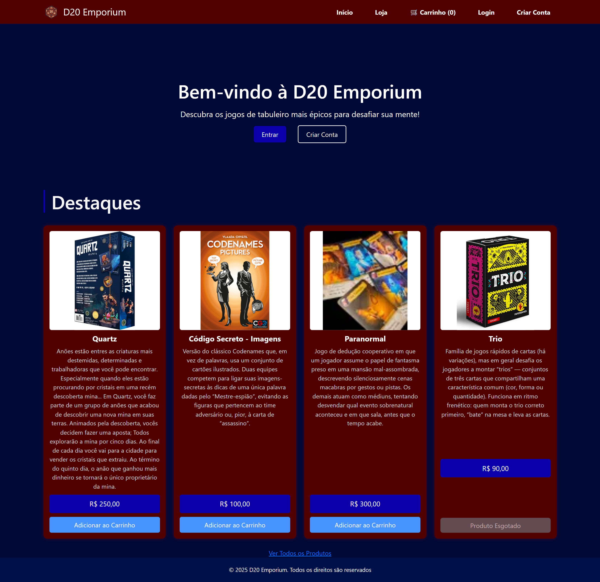

# 🧙‍♂️ D20 Emporium — E-commerce de Jogos de Tabuleiro

Este projeto é um sistema web completo para a venda de jogos de tabuleiro, desenvolvido em PHP e MySQL. O sistema permite o cadastro de produtos, gerenciamento de usuários, controle de pedidos e operação de um carrinho de compras com interface amigável.

---

## 🚀 Funcionalidades

### 👤 Usuários
- Cadastro de novos usuários  
- Login e autenticação de sessão  
- Acesso restrito para administradores  
- Listagem, edição e exclusão de usuários (admin)  

### 🛒 Produtos
- Cadastro de produtos com imagem principal e imagens adicionais  
- Listagem de produtos com foto, descrição e estoque  
- Edição e exclusão de produtos (admin)  
- Verificação de estoque na hora da compra  

### 🧺 Carrinho de Compras
- Adição de produtos ao carrinho  
- Atualização de quantidades com verificação de estoque  
- Remoção de produtos  
- Cálculo automático de subtotal e total  

### 💳 Finalização de Compra
- Formulário com endereço de entrega e forma de pagamento (PIX, cartão, boleto)  
- Registro do pedido e dos itens  
- Atualização automática do estoque  

### 📦 Gerenciamento de Pedidos (Admin)
- Listagem de todos os pedidos  
- Visualização dos detalhes do pedido  
- Alteração do status do pedido (pendente, enviado, etc.)  
- Proteção contra exclusão de produtos/usuários envolvidos em pedidos  

---

## 🛠️ Tecnologias Utilizadas

- **PHP 8+**  
- **MySQL**  
- **HTML5 / CSS3 / Bootstrap 5**  
- **JavaScript**  
- Sessões e Prepared Statements para segurança  
- Armazenamento de imagens em BLOB  

---

## ⚙️ Requisitos

- Servidor local com Apache e MySQL (XAMPP, WAMP ou similar)  
- PHP 7.4+  
- MySQL 5.7+  

---

## 🔧 Instalação

1. Clone este repositório:
    ```bash
    git clone https://github.com/beatrizlauro/ecommerceJogosTabuleiro.git
    ```

2. Importe o banco de dados:
    - Abra o **phpMyAdmin**  
    - Crie o banco `d20_emporium`  
    - Importe o arquivo `d20_emporium.sql`  

3. Inicie o servidor local e acesse:
    ```
    http://localhost/ecommerceJogosTabuleiro/index.php
    ```

---

## 🔐 Acesso Administrativo

- Para acessar funcionalidades de administração, é necessário um usuário com `is_admin = 1` no banco.

---

## 📌 Uso

### 👤 Usuário Comum
1. **Cadastro**: Acesse a página de login e clique em "Criar Conta".  
2. **Login**: Entre com seu usuário e senha.  
3. **Explorar Produtos**: Navegue pela loja, visualize os jogos disponíveis.  
4. **Carrinho**:
   - Clique em "Adicionar ao carrinho" para incluir um produto.  
   - Altere a quantidade ou remova diretamente do carrinho.  
5. **Finalizar Compra**:
   - Informe endereço de entrega e forma de pagamento.  
   - O pedido será registrado com status **"pendente"**.  

### 🛠️ Administrador
1. **Login com usuário admin** (campo `is_admin = 1` no banco).  
2. **Gerenciar Produtos**:
   - Cadastrar, listar, editar ou excluir produtos.
3. **Gerenciar Usuários**:
   - Cadastrar, listar, editar ou excluir contas de usuários.
4. **Gerenciar Pedidos**:
   - Visualize pedidos realizados por clientes.  
   - Altere o status dos pedidos (ex: de "pendente" para "enviado").  

> ⚠️ **Atenção**: Produtos e usuários que já foram utilizados em vendas **não podem ser excluídos**, protegendo a integridade do banco de dados.

---

## 👥 Créditos

Projeto desenvolvido por:

- Ana Flávia Alves Rosa  
- Beatriz da Costa Lauro  
- Brenda Bonaita de Oliveira  

Como parte da disciplina de **Programação II** – Curso de **Sistemas de Informação**, 5º período – 2025.


